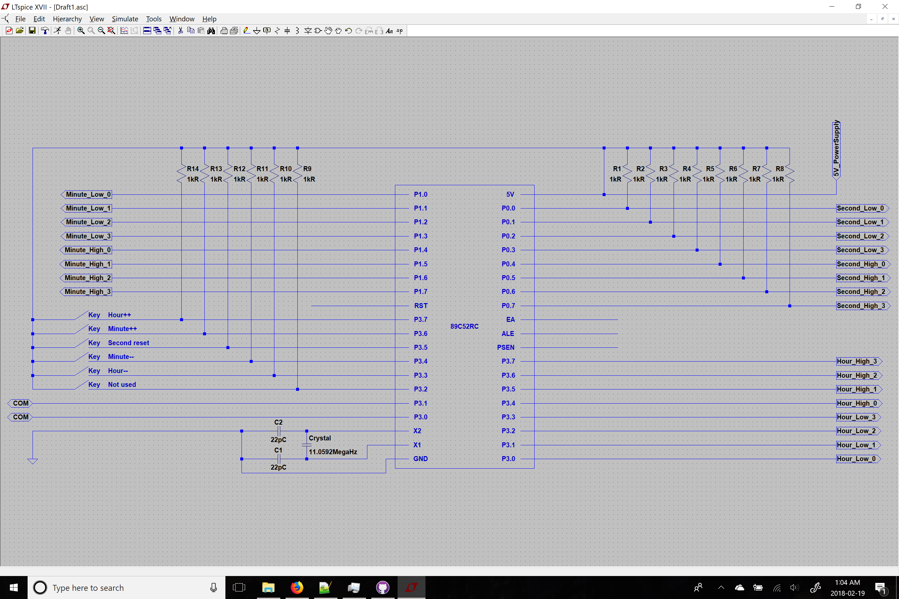
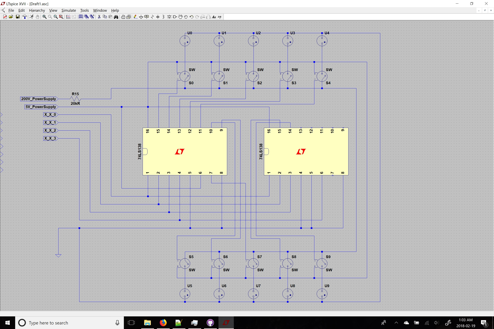
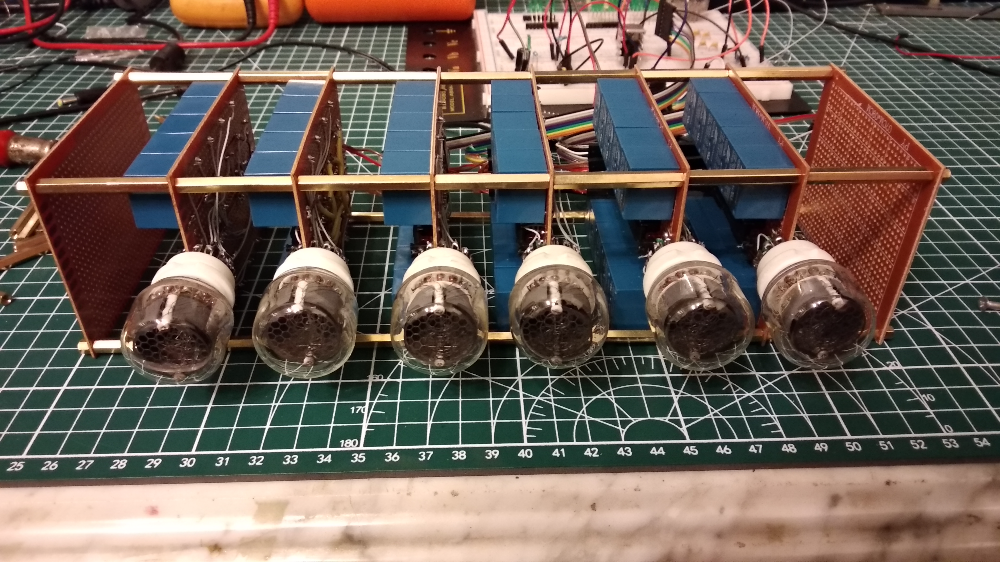
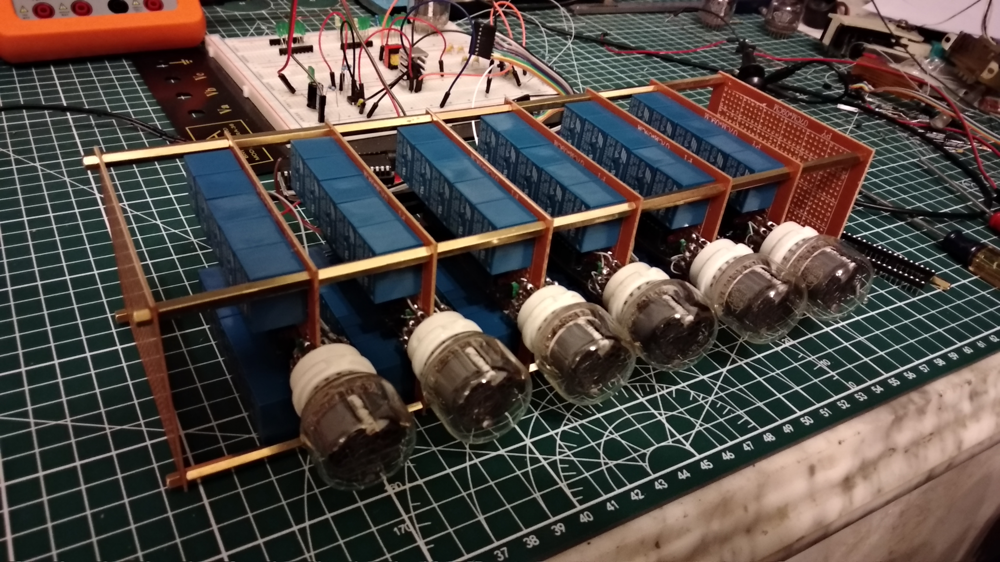

# Nixie-tube-driver

Nixie tube driver code for 51 MCU

This code is designed for 51 MCU with core frequency of 11.0592MHz.

The input (control panel) is on P3: P3.7: Hour++; P3.6: Minute++; P3.5: Second = 0; P3.4: Minute--; P3.3: Hour--.

The output is on I/O P2, P1, and P0. P2: Hour; P1: Minute; P0: Second. Each port is devided into two parts, high value and low value; for example, P1(7:4) is designed for the tens of minute value. The output signal is coded in BCD code, you will need 74/54LS138 to decode this signal into one-hot signal.

For example, if the time is 15:22:08, the output will be:

P2: 00010101; P1: 00100010; P0: 00001000.

After 3-8 decodedr (74LS138):

Hour_H: 1; Hour_L: 5; Min_H: 2; Min_L: 2; Sec_H: 0; Sec_L: 8.

Notice: you will ned an extra 1k resistor for P0 to pull it high.

# 辉光管驱动

51单片机辉光管驱动

这个代码是为使用11.0592Mhz晶振的51单片机设定的。

输入（控制面板）被设定在P3口上：P3.7：时针++；P3.6：分针++；P3.5：秒针归零；P3.4：分针--；P3.3：时针--。

P2，P1，P0将作为时钟时，分，秒信号输出。 每一个Port将会被分为高四位与第四位，比如说，P1的7654脚将作为时针的十位输出。输出编码格式为BCD，你将需要74LS138解码器来将这个信号转化为One-hot信号。

比如说，在15：22：08，输出为：

P2: 00010101; P1: 00100010; P0: 00001000.

通过3-8解码器后（74LS138）:

Hour_H: 1; Hour_L: 5; Min_H: 2; Min_L: 2; Sec_H: 0; Sec_L: 8.

顺便：记得用1k的排阻拉高P0的电位。

# Some images 一些图片

## Circuit 电路图

MCU module 单片机模块

74LS138 decoder module 74LS138解码器模块

## Photoes 照片

